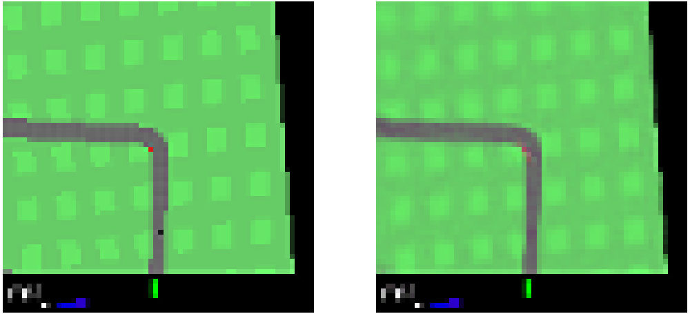
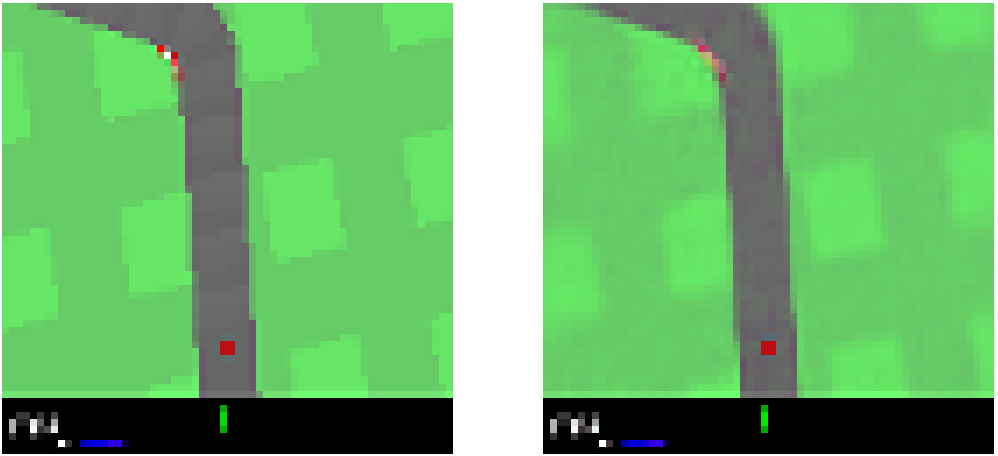

# 
World-Model-PyTorch

--The simplified implementation of <a href="https://proceedings.neurips.cc/paper/2018/hash/2de5d16682c3c35007e4e92982f1a2ba-Abstract.html">World Model</a> based on PyTorch--

## 1. Data Generate
Run `generate_CarRacing_dataset.py` to randomly generate data.

We generated a total of **200** trajectories, with **30** steps executed each time, resulting in a total of **6000** data. Each trajectory is saved separately as a `.npz` file.

Scale the observed image to a uniform size of **64 $\times$ 64**.

In the early stage of the car's movement, we will apply an **additional speed** to make it move as much as possible and collect richer data.

## 2. Train VAE
Firstly, we will train the VAE network. Its latent feature channel is **32**.

A total of **1000** epochs were trained, with a batch size of **128**. 

We have also released the [loss curve](https://github.com/zZhiG/World-Model-PyTorch/blob/main/weights/vae_train/curve_2024.08.12.17.01.56/events.out.tfevents.1723453317.DESKTOP-KBN05BN) during the training process and [final weights](https://github.com/zZhiG/World-Model-PyTorch/blob/main/weights/vae_train/vae_2024.08.12.17.01.56/1000.pt).

Here are some visual examples. On the left is the original image, and on the right is the reconstructed image.

## 3. 
